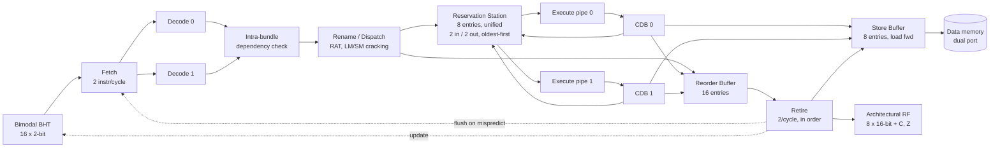

# Superscalar Out-of-Order RISC Processor

A 2-wide, out-of-order, 16-bit RISC core in VHDL-2008. Fetches, renames, issues, and retires two instructions per cycle, with a unified reservation station, a reorder buffer, a store buffer with load forwarding, and a bimodal branch predictor. Simulates with the open-source GHDL toolchain; no vendor tools needed.

Built for EE739 (Processor Design) at IIT Bombay, Jan to Apr 2026.

**Verified:** the self-checking testbench passes **37 / 37 checks across 28 test groups** on a fresh clone (`ghdl 5.x`, `--std=08`). See [Run it](#run-it).

## Microarchitecture



| Stage / structure | What it does |
| --- | --- |
| **Fetch** | Reads a 32-bit word (two instructions) per cycle from instruction memory. Partially decodes the pair to spot branches and consults the predictor. Holds on stall (ROB or RS full), redirects on flush. |
| **Branch predictor** | 16-entry table of 2-bit saturating counters, indexed by PC. Two lookup ports so both fetched instructions get a prediction in the same cycle; updated at retire. |
| **Decode** | Two identical decoders extract register fields, immediates, the predicate condition, and derived control (has_dest, reads_z, is_store, ...). |
| **Intra-bundle dependency check** | Pure combinational. If the second instruction in a fetch pair depends on the first, it is given the first instruction's ROB tag directly instead of reading the RAT, so both can dispatch in the same cycle. |
| **Rename / Dispatch** | Register alias table maps architectural to ROB tags. Dispatches up to two instructions per cycle. `LM` / `SM` (load / store multiple) are cracked into one `LW` / `SW` micro-op per cycle while fetch is held. |
| **Reservation station** | 8 entries, shared by both pipes. Snoops both CDBs to capture operands, issues up to two ready instructions per cycle, oldest first. Snoop, issue, and allocate are resolved in a single process on a local copy of the entries so each phase sees the previous phase's result within the same cycle. |
| **Execute** | Two identical single-cycle ALU pipes. Loads read data memory and the store buffer (for forwarding); the CDB carries the memory data in place of the raw ALU result. |
| **Reorder buffer** | 16-entry circular FIFO. Two allocate ports (dispatch), two complete ports (CDB), two retire ports (head). |
| **Retire** | Commits up to two instructions per cycle in program order: writes the architectural register file and C/Z flags, marks stores in the store buffer as safe to drain, updates the predictor, and raises a flush on a mispredicted branch. |
| **Store buffer** | 8-entry FIFO. Filled from the CDB when a store computes its address and data, committed at retire, drained to memory one per cycle. Loads check it for an address match and forward the youngest matching data. |

Design parameters live in `pkg.vhd`: `DATA_W = 16`, 8 registers, `ROB_SIZE = 16`, `RS_SIZE = 8`, `SB_SIZE = 8`, `BHT_SIZE = 16`.

## ISA

16-bit fixed-width instructions, 8 general registers (R0 is the PC), carry and zero flags. Arithmetic instructions carry a 2-bit predicate (`always`, `Z`, `C`, or carry-in) and a complement bit on the second source, which gives the `ADZ` / `ADC` / `ACA` / `NCU` families their behaviour.

| Opcode | Mnemonic | Encoding | Meaning |
| --- | --- | --- | --- |
| `0000` | `ADI  Rd, Rs, k` | `0000 Rs Rd k[5:0]` | Rd = Rs + sign-extended k |
| `0001` | `ADD  Rc, Ra, Rb` | `0001 Ra Rb Rc cmp cond` | Rc = Ra + (cmp ? ~Rb : Rb), predicated on cond |
| `0010` | `NDU  Rc, Ra, Rb` | `0010 Ra Rb Rc cmp cond` | Rc = ~(Ra & Rb), predicated |
| `0011` | `LLI  Rd, k` | `0011 Rd k[8:0]` | Rd = zero-extended k |
| `0100` | `LW   Rd, Rb, off` | `0100 Rd Rb off[5:0]` | Rd = mem[Rb + off] |
| `0101` | `SW   Ra, Rb, off` | `0101 Ra Rb off[5:0]` | mem[Rb + off] = Ra |
| `0110` | `LM   Rd, mask` | `0110 Rd mask[7:0]` | Load registers in mask from Rd upward |
| `0111` | `SM   Rd, mask` | `0111 Rd mask[7:0]` | Store registers in mask from Rd upward |
| `1000` | `BEQ  Ra, Rb, off` | `1000 Ra Rb off[5:0]` | Branch if Ra == Rb |
| `1001` | `BLT  Ra, Rb, off` | `1001 Ra Rb off[5:0]` | Branch if Ra < Rb |
| `1010` | `BLE  Ra, Rb, off` | `1010 Ra Rb off[5:0]` | Branch if Ra <= Rb |
| `1100` | `JAL  Rd, off` | `1100 Rd off[8:0]` | Rd = PC + 2; jump PC + 2*off |
| `1101` | `JLR  Rd, Rs` | `1101 Rd Rs 000000` | Rd = PC + 2; jump Rs |
| `1111` | `JRI  Rs, off` | `1111 Rs off[8:0]` | Jump Rs + 2*off |

## Run it

Requires [GHDL](https://github.com/ghdl/ghdl) (`brew install ghdl`, or a distro package). No other dependencies.

```sh
./run.sh
```

This analyses the sources in dependency order, elaborates `tb_instr`, and runs it. The last line of output is the result:

```
tb_instr.vhd:541:5:@19045ns:(report note): RESULT: 37 / 37 checks passed
```

`run.bat` does the same on Windows and additionally writes `wave.ghw` for [GTKWave](https://gtkwave.sourceforge.net/).

### What the testbench covers

`tb_instr.vhd` writes a small program into instruction memory through the top-level init port, runs it, and checks architectural register values after each group. The 28 groups cover every opcode, every predicate and complement variant of `ADD` and `NDU` (`ADA`, `ACA`, `AWC`, `ADZ`, `ADC`, `ACZ`, `ACC`, `ACW`, `NDZ`, `NDC`, `NCU`, `NCZ`, `NCC`), taken and not-taken branches, all three jumps, load and store with and without pre-initialised data memory, load-multiple, and a final chain of dependent instructions that exercises renaming, CDB forwarding, and the intra-bundle dependency path.

## Files

| File | Role |
| --- | --- |
| `pkg.vhd` | ISA constants, sizes, and the shared record types (`decoded_instr_t`, RS and ROB entries) |
| `memories.vhd` | Instruction memory (256 x 16-bit, 2 words per read) and dual-port data memory (256 x 16-bit) |
| `arf.vhd` | Architectural register file with C and Z flags |
| `branch_predictor.vhd` | 16-entry 2-bit bimodal BHT, two lookup ports |
| `fetch_unit.vhd` | PC management, 2-wide fetch, stall and flush handling |
| `decoder.vhd` | Instruction field extraction and control derivation |
| `intra_dep_checker.vhd` | Same-cycle dependency between the two fetched instructions |
| `rename_dispatch.vhd` | RAT, dispatch to RS and ROB, `LM` / `SM` cracking |
| `reservation_station.vhd` | Unified 8-entry RS with two-CDB snooping and oldest-first issue |
| `execute_alu.vhd` | One execution pipe (instantiated twice) |
| `rob.vhd` | 16-entry reorder buffer |
| `retire_unit.vhd` | In-order commit, flush, predictor and store-buffer updates |
| `store_buffer.vhd` | 8-entry store buffer with load forwarding and memory drain |
| `superscalar_top.vhd` | Wires the pipeline together; exposes memory init ports for the testbench |
| `tb_instr.vhd` | Self-checking testbench, 28 groups, 37 checks |

## Design notes

- Flushes are precise and originate only at retire, so the architectural state is never speculatively written.
- Loads are executed in the ALU pipe and resolved against the store buffer in the same cycle, which keeps the design free of a separate load queue at the cost of a single-cycle memory model.
- Instruction and data memories are each 256 x 16-bit and simulation-only; there is no cache hierarchy.
- Writes to R0 (the PC) from the retire stage are treated as a redirect and flush the pipeline.

## Author

Arnav Agarwal, Electrical Engineering, IIT Bombay. [arnavagarwal05.github.io](https://arnavagarwal05.github.io)
